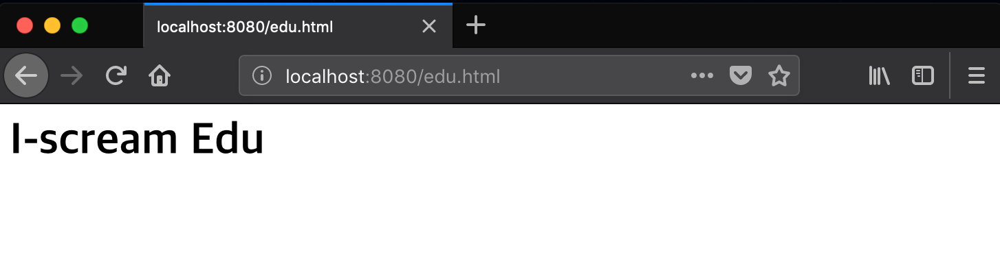
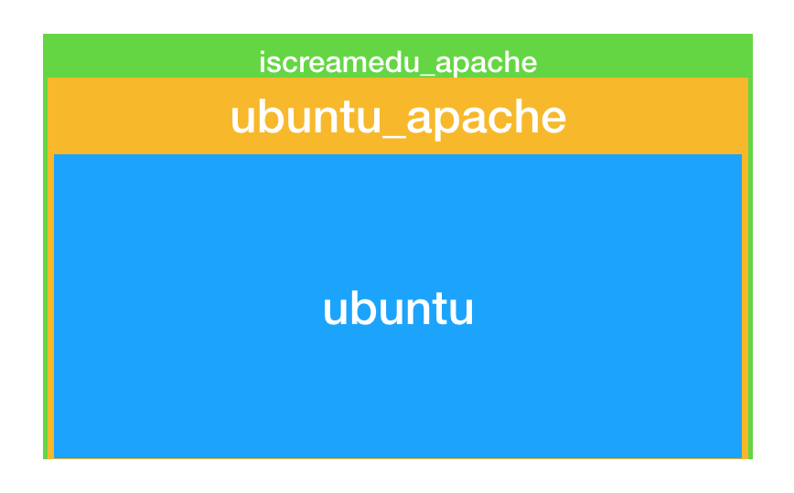

# Build Docker Image

## 목차
- `docker commit` 명령어로 사용자 정의 이미지 만들기
- 도커 이미지 구조
- `Dockerfile`로 사용자 정의 이미지 만들기
    - `apache2`가 설치된 이미지
    - 빌드 컨텍스트와 `Dockerfile` 빌드 과정
    - Dockerize Express App
    - Dockerize Spring App 
- 도커허브에 이미지 배포
- 정리

## `docker commit` 명령어로 사용자 정의 이미지 만들기
당연하게도 우리는 우리의 입맛에 맞는 사용자 정의 이미지가 필요합니다. 이번에는 간단한 방식으로 우리가 원하는 도커 이미지를 만들어보면서 도커 이미지의 구조에 대해서 살펴보겠습니다. 
(이번 파트에서 다룰 내용은 사실 사용자 정의 이미지를 만들때 일반적으로 사용하는 방식이 아니며 권장되는 방식도 아닙니다. 
그러나 도커 이미지의 레이어가 어떻게 쌓이는 지 확인하기에는 좋습니다.)

ubuntu 이미지에 apache2를 설치한 사용자 정의 이미지를 만들고, 그 이미지 기반으로 간단한 웹서버 역할을 하는 사용자 정의 이미지를 만들어 보겠습니다. 

우선 아래의 명령어를 통해서 ubuntu 이미지를 실행합니다.
```bash
docker run -it --rm --name ubuntu_apache ubuntu:18:04 
```

컨테이너에 들어오게 되면 아래 명령어로 apache2를 설치합니다.
```bash
apt-get update
apt-get install -y apache2
```

그리고 나서 `ctrl` + `p` + `q`를 눌러 컨테이너를 중지시키지 않고 빠져나옵니다. 

현재 컨테이너의 상태를 그대로 이미지로 정의할 수 있는 명령어가 있습니다. 바로 `docker commit`입니다. 
이 명령어를 통해서 apache2를 설치한 컨테이너의 현재 상태를 그대로 이미지로 만들어 보겠습니다.

```bash
docker commit -a "voyagerwoo" -m "install apache2" ubuntu_apache ubuntu_apache:latest
```
`-a`는 이미지를 만든 사람의 정보를 추가하는 옵션이고, `-m`은 커밋 메시지를 기술하는 옵션입니다. 
그 뒤에는 컨테이너 ID 또는 이름을 입력하고 마지막으로 우리가 정의한 이미지 이름과 태그를 적습니다. 

아래 명령어로 진짜로 사용자 정의 이미지가 만들어졌는지 확인해봅시다.
```bash
docker images
```
```
REPOSITORY          TAG                 IMAGE ID            CREATED             SIZE
ubuntu_apache       latest              50e25f3f033d        14 minutes ago      207MB
ubuntu              18.04               1d9c17228a9e        3 days ago          86.7MB
```
사이즈가 많이 커진것을 확인할 수 있습니다. 이번에는 `ubuntu_apache` 이미지를 실행해서 apache2가 잘 동작하는지 확인해보겠습니다.
다음 명령어로 컨테이너를 실행합니다.
```bash
docker run -it --rm -p 8080:80 --name iscreamedu_apache ubuntu_apache:latest
``` 
그리고 다음 명령어로 apache2를 실행합니다.
```bash
service apache2 start
```
문제가 없다면 브라우저에서 http://localhost:8080 주소를 입력하면 아파치 기본 웹 페이지를 확인할 수 있을것입니다. 

이번에는 새로운 웹페이지를 추가하고 그 추가한 컨테이너의 상태를 그대로 이미지로 만들어보겠습니다. 
아래 명령어로 `eng.html`이라는 웹 페이지를 apache2에 추가해보겠습니다.

```bash
cd /var/www/html/
echo "<h1>I-scream Edu</h1>" > eng.html
```
브라우저에서 http://localhost:8080/eng.html 주소에 접속해서 확인해봅니다. 이 웹페이지를 제공하는 웹서버를 그대로 도커 이미지로 만들어보겠습니다.
`ctrl` + `p` + `q`를 눌러 컨테이너를 중지시키지 않고 빠져나옵니다. 

```bash
docker commit -a "voyagerwoo" -m "add iscream-edu webpage" iscreamedu_apache iscreamedu_apache:latest
```  
그럼 이제 실행중인 모든 컨테이너를 종료하고 `iscreamedu_apache` 이미지로 컨테이너를 실행하여 추가한 웹페이지가 잘 동작하는 지 확인해보겠습니다.

```bash
docker run -it --rm -p 8080:80 iscreamedu_apache:latest
```
```bash
service apache2 start
```



## 도커 이미지 구조
위에서 정의한 `ubuntu_apache`와 `ubuntu_apache`이미지를 통해서 도커 이미지가 어떤 구조인지 살펴보겠습니다. 
`docker history` 라는 명령어를 통해서 어떻게 이미지가 구성되어있는지 살펴보겠습니다. 우선은 `ubuntu` 이미지부터 살펴보겠습니다.

```bash
docker history ubuntu:18.04
```
```
IMAGE               CREATED             CREATED BY                                      SIZE                COMMENT
1d9c17228a9e        4 days ago          /bin/sh -c #(nop)  CMD ["/bin/bash"]            0B                  
<missing>           4 days ago          /bin/sh -c mkdir -p /run/systemd && echo 'do…   7B                  
<missing>           4 days ago          /bin/sh -c rm -rf /var/lib/apt/lists/*          0B                  
<missing>           4 days ago          /bin/sh -c set -xe   && echo '#!/bin/sh' > /…   745B                
<missing>           4 days ago          /bin/sh -c #(nop) ADD file:c0f17c7189fc11b6a…   86.7MB
```

아래에서부터 총 5개의 레이어를 통해서 도커 이미지가 만들어졌습니다. 나중에 자세히 살펴보겠지만 명령어들을 통해서 이미지 레이어가 하나하나 쌓였군요.

그럼 이번에는 ubuntu:18.04라는 이미지를 기반으로 만든 `ubuntu_apache`를 살펴보겠습니다. 
```bash
docker history ubuntu_apache
```
```
IMAGE               CREATED             CREATED BY                                      SIZE                COMMENT
50e25f3f033d        23 hours ago        /bin/bash                                       120MB               install apache2
1d9c17228a9e        4 days ago          /bin/sh -c #(nop)  CMD ["/bin/bash"]            0B                  
<missing>           4 days ago          /bin/sh -c mkdir -p /run/systemd && echo 'do…   7B                  
<missing>           4 days ago          /bin/sh -c rm -rf /var/lib/apt/lists/*          0B                  
<missing>           4 days ago          /bin/sh -c set -xe   && echo '#!/bin/sh' > /…   745B                
<missing>           4 days ago          /bin/sh -c #(nop) ADD file:c0f17c7189fc11b6a…   86.7MB
```
아래부터 살펴보면 (이쯤이면 당연하게도) 우분투와 동일한 레이어 위에 아파치를 설치한 레이어가 새로 생겼네요. 
어떻게 우분투와 동일한 레이어인지 확인하는 방법은 이미지의 ID를 보는 것입니다. `1d9c17228a9e` 이미지 아이디가 같네요!

그럼 마지막으로 `ubuntu_apache` 이미지위에서 `eng.html`파일을 추가한 iscreamedu_apache 이미지를 살펴보겠습니다.

```bash
docker history iscreamedu_apache
```
```
IMAGE               CREATED             CREATED BY                                      SIZE                COMMENT
8cd359918f28        22 hours ago        /bin/bash                                       905B                add iscream-edu webpage
50e25f3f033d        23 hours ago        /bin/bash                                       120MB               install apache2
1d9c17228a9e        4 days ago          /bin/sh -c #(nop)  CMD ["/bin/bash"]            0B                  
<missing>           4 days ago          /bin/sh -c mkdir -p /run/systemd && echo 'do…   7B                  
<missing>           4 days ago          /bin/sh -c rm -rf /var/lib/apt/lists/*          0B                  
<missing>           4 days ago          /bin/sh -c set -xe   && echo '#!/bin/sh' > /…   745B                
<missing>           4 days ago          /bin/sh -c #(nop) ADD file:c0f17c7189fc11b6a…   86.7MB  
```
웹페이지를 추가하기 전 레이어의 아이디가 `50e25f3f033d`로 ubuntu_apache 이미지와 같군요.

위의 이미지의 크기는 각각 207MB, 207MB, 86.7MB 입니다. 그럼 이 이미지들이 디스크에 207 + 207 + 86.7 = 500.7MB 용량을 차지하고 있을까요?   
```
REPOSITORY          TAG                 IMAGE ID            CREATED             SIZE
iscreamedu_apache   latest              8cd359918f28        22 hours ago        207MB
ubuntu_apache       latest              50e25f3f033d        23 hours ago        207MB
ubuntu              18.04               1d9c17228a9e        4 days ago          86.7MB
```

(이쯤되면 당연하게도) 아닙니다. 기존 이미지에서 변경사항만 한층 한층 저장하고 새로운 이미지는 기존 레이어를 포함해서 만들게 됩니다. 
그래서 사실 207MB 만 차지하고 있습니다.



이미지를 지워보겠습니다. 지울때는 `docker rmi`라는 명령어를 사용합니다.
현재 상황에서 `ubuntu` 이미지를 지우면 어떻게 될까요? 현재 우리가 만든 이미지들은 `ubuntu` 이미지 기반으로 만들어져 있는데 다 고장나게 될까요?
한번 큰 맘 먹고 지워보겠습니다. 

```bash
docker rmi ubuntu:18.04
```
```
Untagged: ubuntu:18.04
Untagged: ubuntu@sha256:868fd30a0e47b8d8ac485df174795b5e2fe8a6c8f056cc707b232d65b8a1ab68
```
이미지는 지워지지 않습니다. ubuntu 이미지를 기반으로 만든 `ubuntu_apache` 이미지가 있기 때문입니다. 그래서 이미지에 부여된 이름만 제거하는 `Untag`만 하게 됩니다.

가장 최상단 레이어의 이미지인 `iscreamedu_apache`를 지워서 실제로 지워지는지 확인해보겠습니다. 

먼저 해당 이미지로 컨테이너가 실행되고 있는 중이라면 중지시켜야 합니다. 
이미지를 강제로 지울 수는 있지만 이미 실행되는 컨테이너가 있으므로 `Untag` 하게 되고 이미지의 이름이 `<none>`인 댕글링 이미지가 생성됩니다.
이런 댕글링 이미지는 도커 이미지를 가지고 이런 저런일을 하다 보면 많이 생기는데요, `docker image prune` 이 명령어로 한번에 삭제할 수 있습니다.

컨테이너가 종료되었다면 이미지를 삭제해 보겠습니다.

```bash
docker rmi iscreamedu_apache
```
```
Untagged: iscreamedu_apache:latest
Deleted: sha256:8cd359918f285648a35ff6742ca6e3e124cbf9b99bfdff2ca03cfa78d40856c2
Deleted: sha256:5c8b351ee5ddc41a75e94732e97d04f6d24c71e47391cb5793b6bd8bcda214f3
```
이미지가 드디어 지워졌다는 메시지가 뜨네요. 그럼 하위 이미지인 `ubuntu_apache`도 삭제가 되었을까요?
다행히도 그건 아니고, 최상단 레이어인 `eng.html` 파일을 추가한 부분만 삭제가 된 것입니다.

그럼 이제 마지막으로 `ubuntu_apache`도 지워보겠습니다.

```bash
docker rmi ubuntu_apache
```
```
Untagged: ubuntu_apache:latest
Deleted: sha256:50e25f3f033dc998341e9d94ac1952a9ad7937109335e2dc0ba1491f920eabdf
Deleted: sha256:eb77ebc75ba7d61c785fc900aaa9c58079f062a7c8d38319258573d5532eb678
Deleted: sha256:1d9c17228a9e80a0a23927f24f3cf17d012cf0bb3eae5e3541a8c6987ab9bd5a
Deleted: sha256:3288cd6e6e7d42bcb4a74121b412c42a11f96da52685e42dbf9de6a747a55c6b
Deleted: sha256:b1636589630239bdb9153f95ac564bcd2afd9202aaf8511cbf5a9a37e03daf35
Deleted: sha256:043f492f40c539cfe7cee4cb8aae00ed1d5b19e864fbe6ea35ec92a2333bacc4
Deleted: sha256:2fb7bfc6145d0ad40334f1802707c2e2390bdcfc16ca636d9ed8a56c1101f5b9
```

뭔가 많이 지워졌습니다. 이 이미지를 가지고 만든 이미지도 없기 때문에 모든 레이어를 삭제했습니다.

### 이미지 구조 정리
도커 이미지는 레이어로 구성되어 있습니다. 기존 레이어에서 새로운 레이어를 추가하여 새로운 이미지를 쉽게 만들 수 있습니다. 
기존 레이어 이미지를 삭제해도 그 이미지를 통해서 만든 다른 이미지에는 영향을 주지 않습니다. 그냥 이름만 빠지는 `Untag`가 되었기 때문이죠.
실제로 이미지를 지우려면 해당 이미지로 실행중인 컨테이너가 없어야하며, 해당 이미지를 기반으로 만든 새로운 이미지도 없어야합니다.


## `Dockerfile`로 사용자 정의 이미지 만들기
`docker commit`을 이용해서 이미지를 만든는 방식은 좋은 방식이 아닙니다. 컨테이너에 들어가서 그냥 명령어를 실행하기 때문에 그 이미지에 대한 정의나 명세가 없습니다.
따라서 변경을 추적하기 쉽지 않습니다.

`Dockerfile`을 이용하면 그 문제가 해결됩니다. 일련의 명령어들로 해당 이미지를 정의하고 `docker build`라는 명령어를 통해서 `Dockerfile`에서 이미지를 생성할 수 있습니다. 
`Dockerfile`은 코드이기 때문에 버전관리도 쉽게 할 수 있습니다. 그럼 이번에는 `Dockerfile`에 대해서 배워보도록 하겠습니다. 

### apache2가 설치된 이미지
지난 실습과정에서 apache2가 설치된 도커 이미지를 만들어보았습니다. 이번에는 `Dockerfile`을 이용해서 똑같이 만들어 보겠습니다.
우선 apache-ubuntu 라는 디렉토리를 만들고 확장자 없이 `Dockerfile` 이라는 파일을 만듭니다. 그리고 그 파일에 아래에 코드를 작성해봅니다.

```dockerfile
FROM ubuntu:18.04

RUN apt-get update
RUN apt-get install -y apache2
WORKDIR /var/www/html
RUN echo "<h1>I-scream edu</h1>" > eng.html
ADD index.html .
EXPOSE 80

CMD ["apachectl", "-DFOREGROUND"]
```

명령어를 하나하나 살펴보겠습니다.

- `FROM`은 기반으로 할 이미지를 정의하는 명령어입니다. 현재 코드에서는 ubuntu:18.04 이미지로 만들었습니다.
- `RUN`은 커맨드 라인 명령어를 실행해주는 명령어입니다. 현재 코드에서는 apache2를 설치하기 위해서 ubuntu의 패키지 매니저를 실행하고 있습니다. 
- `WORKDIR`은 현재 워킹 디렉토리를 변경해주는 명령어입니다. 공식 문서에서 명료함과 신뢰성을 위해서 `RUN cd /dir/`을 하지 말고 `WORKDIR` 명령어를 사용하라고 제안하고 있습니다. 
현재 코드에서는 아파치 웹 루트 디렉토리로 워킹 디렉토리를 변경하였습니다.
- `ADD`는 빌드시에 주어진 컨텍스트에서 첫번째 인자로 주어진 파일이나 폴더를 두번째 인자로 주어진 컨테이너 경로에 추가하는 명령어입니다. 
- `EXPOSE`는 인자로 주어진 포트를 외부와 통신 가능하게 노출시키는 명령어입니다. 기본적으로 컨테이너 실행시에 `-p` 옵션을 주게 되면 암묵적으로 EXPOSE 가 된다고 합니다.
- `CMD`는 컨테이너가 시작될 때 실행될 명령어를 설정하는 명령어입니다. 현재 코드에서는 apache 웹서버를 foreground로 실행하는 명령어를 설정했는데요, 컨테이너가 시작되면 이 명령어를 통해서 웹 서버가 실행됩니다.


그 다음으로 같은 위치에 `index.html` 파일을 하나 만듭니다. `ADD` 명령어로 이미지에 추가할 파일입니다.
```html
<!DOCTYPE html>
<html lang="en">
<head>
    <meta charset="UTF-8">
    <title>아이스크림 에듀</title>
</head>
<body>
    <h1>아이스크림 에듀</h1>
</body>
</html>
```

그럼 이제 빌드해 보겠습니다. 처음 빌드하게 되면 이미지가 없다면 이미지 부터 다운받고 `Dockerfile`의 명령어를 한줄 한줄 실행하게 됩니다. 그 과정을 표준 출력으로 확인할 수 있습니다.
빌드하는 명령어는 다음과 같습니다.

```bash
docker build -t apache-ubuntu:1 .
```
`-t` 옵션은 `--tag` 옵션으로 이미지의 이름과 태그를 설정하는 옵션입니다. 태그는 생략하게 되면 `latest` 라고 설정됩니다. 

맨 마지막의 점은 컨텍스트 경로입니다. 이 부분은 잠시 후에 자세히 다뤄보겠습니다. 

만약 파일 명이 `Dockerfile`이 아니라면 `-f` 옵션을 통해서 `Dockerfile`을 지정해줘야합니다.

빌드 과정에서 에러가 없었다면 아래와 같은 문구를 확인하실 수 있을 겁니다.

```
Successfully built 9c416bf57b50
Successfully tagged apache-ubuntu:1
```

이제 이 이미지를 컨테이너로 실행해 보겠습니다. 
```bash
docker run -it --rm -p 8080:80 apache-ubuntu
```
아래 두 링크를 통해서 잘 동작하는지 확인해 봅시다.
- http://localhost:8080/
- http://localhost:8080/eng.html


이런 식으로 우리만의 도커 이미지를 만들 수 있습니다.


#### 잠깐, 컨테이너가 시작될 때 실행될 명령어는 꼭 foregroud로 실행되어야 합니다!
기본적으로 컨테이너가 시작할 때 foreground로 실행되는 프로세스가 없다면 컨테이너는 할 일이 없다고 여기고 정지됩니다. 
그러므로 도커 컨테이너는 하나의 프로세스 foreground로 실행하도록 해야합니다. 
예컨데 아파치 이미지는 시작할때 아파치 웹서버를 foreground로 실행해야 하며, 스프링 WAS의 경우에는 톰캣을 foreground로 실행해야합니다. 

### 빌드 컨텍스트와 `Dockerfile` 빌드 과정 
`docker build -t apache-ubuntu:1 .` 이 명령에서 마지막 인자는 빌드 컨텍스트입니다. 빌드 컨텍스트는 이미지를 생성하는데 필요한 각종 파일을 담고 있는 디렉토리입니다.
컨텍스트에 있는 파일을 `ADD` 또는 `COPY` 해서 이미지를 만듭니다. 위의 예제에서도 컨텍스트에 있는 `index.html`을 이미지에 추가했습니다. 
그리고 보통 `Dockerfile`의 경로와 컨텍스트 경로는 같은 경우가 많습니다.

도커 이미지 빌드시에 가장 먼저하는 일은 컨텍스트를 불러오는 일입니다. 그래서 컨텍스트에 사이즈가 크면 클수록 컨텍스트를 불러오는데 오래걸리고 이미지 생성 시간이 길어집니다.
그래서 `.gitignore` 처럼 `.dockerignore` 라는 파일을 통해서 컨텍스트에 추가하지 않아도 될 파일의 리스트를 적어둘 수 있습니다. (`.dockerignore` 파일은 컨텍스트 최상위 경로에 있어야합니다.)

`docker build` 명령어는 컨텍스트를 불러온 다음 `Dockerfile`의 기록된 일련의 명령어를 컨테이너와 함께 실행하고 커밋(`docker commit`)함으로써 이미지를 만들어냅니다. 
한줄 한줄 실행할 때 마다 새로운 컨테이너를 실행하고 그 내부에서 명령어를 실행합니다. 아래의 로그는 도커 빌드 기록입니다. 이 기록을 통해서 이미지 빌드 과정을 자세히 살펴보겠습니다. 
  
```③④⑤⑥⑦⑧⑨⑩
Sending build context to Docker daemon  3.072kB ······①
Step 1/8 : FROM ubuntu:18.04 ······②           
 ---> 1d9c17228a9e
Step 2/8 : RUN apt-get update
 ---> Using cache ······③
 ---> 7ac962e06089
Step 3/8 : RUN apt-get install -y apache2
 ---> Using cache
 ---> 0293a3f62bb9
Step 4/8 : WORKDIR /var/www/html
 ---> Using cache
 ---> ba7d5ed25c56
Step 5/8 : RUN echo "<h1>I-scream edu</h1>" > eng.html
 ---> Using cache
 ---> b0675ebc9784
Step 6/8 : ADD index.html . ······④
 ---> ae73cb8787b4
Step 7/8 : EXPOSE 80
 ---> Running in 6f95285bf0e1 ······⑤
Removing intermediate container 6f95285bf0e1 ······⑥
 ---> e97ba181724f
Step 8/8 : CMD ["apachectl", "-DFOREGROUND"]
 ---> Running in b316e0eff983
Removing intermediate container b316e0eff983
 ---> d73947cb8ef3
Successfully built d73947cb8ef3 ······⑦
Successfully tagged apache-ubuntu:latest ······⑧
```

- ① : 빌드 컨텍스트를 도커 데몬에게 전송하고 있다. 도커 데몬은 받은 컨텍스트를 가지고 이미지를 빌드한다.
- ② : `Dockerfile`의 명령어 한줄 한줄을 step으로써 실행하게 된다.
- ③ : 한번 실행했던 명령어라면 캐싱된 데이터를 활용하여 이미지를 빌드한다.
- ④ : `ADD`나 `COPY` 같은 명령어는 컨테이너를 따로 실행하지 않는다.
- ⑤ : `EXPOSE` 명령어가 컨테이너를 실행하고 있다.
- ⑥ : `EXPOSE` 명령어가 컨테이너에서 성공적으로 실행을 마치고 커밋까지 한 후 컨테이너를 제거하고 있다.
- ⑦ : 빌드가 성공적으로 완료되었다.
- ⑧ : 태깅이 완료되었다.

### Dockerize Express App

### Dockerize Spring App

## 도커허브에 이미지 배포


## 참고자료 
https://medium.com/@jessgreb01/digging-into-docker-layers-c22f948ed612
https://rampart81.github.io/post/docker_image/
https://nodejs.org/ko/docs/guides/nodejs-docker-webapp/
https://docs.docker.com/v17.09/engine/userguide/eng-image/dockerfile_best-practices
https://stackoverflow.com/questions/22111060/what-is-the-difference-between-expose-and-publish-in-docker
https://stackoverflow.com/questions/25775266/how-to-keep-docker-container-running-after-starting-services
