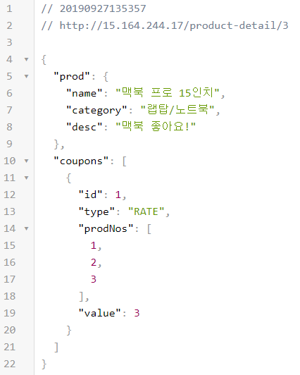
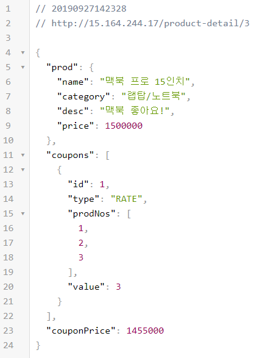

# Docker Swarm

## (나의) 웹 어플리케이션 서버 배포의 변천사

### WAR를 빌드하고 톰캣에 넣어서 배포
- 장점:
- 단점: 톰캣을 미리 설치해둬야한다.그리고 톰캣 스크립트가 복잡하다.

### JAR를 빌드하고 JAR를 실행해서 배포
- 장점: 자바만 설치되어 있다면 어디서든 실행가능하다.
- 단점: 스케일링이 안된다. 무중단 배포하려면 복잡한 스크립트가 필요하다. 또한 여러 프로세스를 실행하게 되면 로드 밸런서가 필요하다.

### 위의 것들을 도커이미지로 만들어서 실행
- 장점: 단순한 자바 애플리케이션은 그냥 도커로 실행하나 JAR로 실행하나 큰 차이가 없지만, OS에 종속적인 네이티브 기능들을 사용할 때 도커 이미지로 만들면 유용하다.
- 단점: 위와 마찬가지의 단점이 있다.

## 필요한 기능
- 무중단 배포
- 스케일 관리

## 도커 스웜 소개
### 도커 엔진과 통합된 클러스터 관리
다른 부가적인 설치 없이 도커를 설치하고 도커의 CLI를 이용하여 도커 스웜 클러스터를 구축할 수 있습니다.

### 분산 설계
노드들은 네트워크가 연결된 채로 분산되어 있고, `manager`, `worker` 두가지 역할을 가질 수 있습니다.

### 선언적 서비스 모델
선언적으로 서비스의 원하는 상태를 정의하고 구성합니다.

### 스케일링 (확장과 축소)
애플리케이션의 복제의 개수도 서비스의 상태로서 선언적으로 정의되며 개수를 변경하게 되면 자동으로 스케일링합니다.

### 상태 조정(회복)
선언적으로 정의한 상태를 자동으로 회복합니다. 예를 들어, 복제본의 개수가 3개이고 컨테이너를 실행하던 특정 노드가 알 수 없는 이유로 종료될 경우 자동으로 다른 노드에 컨테이너를 실행하여 복제본의 개수를 맞춥니다.

### 멀티 호스트 네트워킹 (오버레이 네트워크)
오버레이 네트워크를 이용하여 멀티 호스트 환경에서 마치 같은 호스트처럼 네트워크 환경을 구성할 수 있습니다.

### 서비스 검색
서비스들은 도커 스웜의 DNS에 특정 이름으로 할당되고 스웜 내 서비스들은 그 이름을 가지고 네트워킹이 가능합니다.

### 로드 밸런싱
복제본의 개수가 여러개일 때 도커 스웜이 자동으로 로드밸런싱을 합니다.

### 기본 보안
기본적으로 노드간 통신에서 TLS를 강제합니다.

### 롤링 업데이트
여러 복제본을 가진 서비스들은 기본적으로 롤링업데이트를 하며, 이를 이용하여 무중단 배포가 가능합니다.

## 실습
### 시나리오

쇼핑몰을 운영하고 있습니다. `쇼핑몰 프론트 서비스`는 `상품 백앤드 서버스`와 `쿠폰 백앤드 서비스`로 구성되어 있습니다. `쇼핑몰 프론트 서비스`에서 상품 상세 API는 상품, 쿠폰 백앤드에서 각 정보를 조회하고 조합하여 응답을 보내줍니다.
이 세 서비스는 각각 도커라이즈 되어있다. 노드가 세개인 도커 스웜을 이용하여 배포하여 아래의 목표를 달성해봅니다.

- 트래픽에 따라 스케일이 조정되어야 한다. 
- 무중단으로 배포되어야 한다.


### 도커 스웜 노드 준비
- 도커 설치
- 마스터 노드 도커 스웜 초기화
```
docker swarm init --advertise-addr 172.26.8.153
```
- 워커 노드 등록
```
docker swarm join --token SWMTKN-1-1ppzdtuuy3rpulzm34w9hyqc1d1ykl2i638igpynyvjlgf6qps-9hprisuy8zhpgjglhyw1uxddb 172.26.8.153:2377
```

### 프로젝트 클론
```
git clone https://github.com/voyagerwoo/demo-shoppingmall-msa
cd demo-shoppingmall-msa
```

### 오버레이 네트워크 생성

```
docker network create -d overlay --attachable backend
docker network create -d overlay --attachable frontend
```

#### 오버레이 네트워크


호스트가 달라도 마치 같은 노드에 있는 것처럼 접근할 수 있게 해주는 네트워크 방식입니다.

### 상품 백앤드 서비스 배포

#### docker stack 
```
version: "3.6"
services:
  app:
    image: voyagerwoo/demo-shoppingmall-prod-service:${IMG_TAG:-latest}
    networks:
      backend:
        aliases:
          - prod.api
    deploy:
      mode: replicated
      replicas: ${REPLICAS:-2}
      update_config:
        parallelism: 1
        order: start-first
        failure_action: rollback
      resources:
        limits:
          memory: 200M
        reservations:
          memory: 100M
    healthcheck:
      test: ["CMD", "curl", "-f", "http://localhost:3001/health"]
      interval: 10s
      timeout: 5s
      retries: 3
      start_period: 10s

networks:
  backend:
    external: true
    name: backend
```

#### 배포

```
docker stack deploy -c={도커 컴포즈 파일} {스택 이름}
```

```
cd prod_service
docker stack deploy -c=docker-stack.yml prod
```

#### 배포확인
> 기본적으로 서비스의 전체 이름은 `{스택이름}_{서비스이름}` 이다.
> 예를 들어, 스택이 `prod` 서비스가 `app`이면 `prod_app`

- 전체 서비스 확인
    ```
    docker service ls
    ```
- 특정 서비스 컨테이너 확인
    ```
    docker service ps prod_app
    ```
- watch를 이용해서 모니터링 하기
    ```
    watch docker service ps prod_app
    ```
- 완전 자세히 보기
    ```
    docker service inspect prod_app
    ```

#### 서비스
이미지의 실행 방식(사용할 포트, 배포 방식, 리소스 등)에 대한 정의를 담고 있는 논리적인 객체를 의미합니다. 위의 도커 스택에서는 `app`이라는 서비스가 정의되어 있습니다.

#### 스택
스택은 서비스들의 집합으로 각 서비스가 의존하는 객체들을 정의하고 공유합니다. 위의 도커 스택은 `app`이라는 서비스와 서비스에서 사용하는 네트워크를 정의하고 있습니다.

### 쿠폰 백앤드 서비스 배포
#### docker stack 
```
version: "3.6"
services:
  app:
    image: voyagerwoo/demo-shoppingmall-coupon-service:${IMG_TAG:-latest}
    networks:
      backend:
        aliases:
          - coupon.api
    deploy:
      mode: replicated
      replicas: ${REPLICAS:-2}
      update_config:
        parallelism: 1
        order: start-first
        failure_action: rollback
      resources:
        limits:
          memory: 200M
        reservations:
          memory: 100M
    healthcheck:
      test: ["CMD", "curl", "-f", "http://localhost:3002/health"]
      interval: 10s
      timeout: 5s
      retries: 3
      start_period: 10s

networks:
  backend:
    external: true
    name: backend

```
#### 배포

```
cd coupon_service
docker stack deploy -c=docker-stack.yml coupon
```

### 쇼핑몰 프론트 서비스 배포
#### docker stack
백앤드용 서비스들과는 다르게 프론트 앤드 서비스는 포트를 정의하여 외부에 오픈합니다.

```
version: "3.6"
services:
  app:
    image: voyagerwoo/demo-shoppingmall-front-service:${IMG_TAG:-latest}
    ports:
      - "80:8080"
    networks:
      frontend:
    deploy:
      mode: replicated
      replicas: ${REPLICAS:-2}
      update_config:
        parallelism: 1
        order: start-first
        failure_action: rollback
      resources:
        limits:
          memory: 200M
        reservations:
          memory: 100M
    healthcheck:
      test: ["CMD", "curl", "-f", "http://localhost:8080/health"]
      interval: 10s
      timeout: 5s
      retries: 3
      start_period: 10s

networks:
  frontend:
    external: true
    name: backend

```

#### 배포

```
cd front_service
docker stack deploy -c=docker-stack.yml front
```
### 테스트
상품 상세 API를 호출해봅니다.



### 스케일인아웃
도커 스택을 정의할 때, 환경변수로 `REPLICAS`를 만들고 기본값은 2를 넣었습니다. 이를 이용하여 복제본의 개수를 변경해봅니다.

```
export REPLICAS=4 && docker stack deploy -c=docker-stack.yml front
watch docker service ps front_app 
```

### 서비스 업데이트와 무중단
```
deploy:
    mode: replicated
    replicas: ${REPLICAS:-2}
    update_config:
        parallelism: 1
        order: start-first
        failure_action: rollback
```
위 코드는 이 서비스가 어떻게 배포될지에 대해서 정의하고 있습니다. 복제본이 여러개 있는 모드로 배포가 되며 복제본의 개수만큼 복제됩니다. 

업데이트가 될때 동시에 하나씩 업데이트가 되고 종료 후 하나씩 배포되는 것이 아니라 먼저 배포하고 컨테이너가 완전히 올라오면(헬스 체크가 성공하면) 기존의 컨테이너는 종료됩니다. 만약 헬스 체크가 실패하면 롤백됩니다.

도커 스택에 이미지 태그를 환경변수로 넣었습니다. 이를 이용하여 상품에 매핑된 쿠폰으로 가격을 계산하여 보여주는 기능이 추가된 서비스를 배포해보겠습니다.

```
export IMG_TAG=2 && docker stack deploy -c=docker-stack.yml front
```
계속 API를 호출하여 중단이 있느지 테스트합니다.



### 불편한점
- 로그 보기
- 컨테이너의 묶음을 하나의 단위로 관리하고 싶을때


## 정리
- 도커만 설치했다면 간단하게 스웜 클러스터 구축 가능
- 도커 스택을 이용하여 스택과 서비스의 상태를 정의
- 도커 스웜이 정의된 상태를 확인하고 조정
- 오버레이 네트워크를 통해서 여러 호스트간 네트워킹 가능
- 롤링 업데이트를 통해서 기본적으로 무중단 배포를 지원

## 참고 자료
- https://docs.docker.com/get-started/part3/
- https://docs.docker.com/compose/compose-file
- https://subicura.com/2017/02/25/container-orchestration-with-docker-swarm.html
